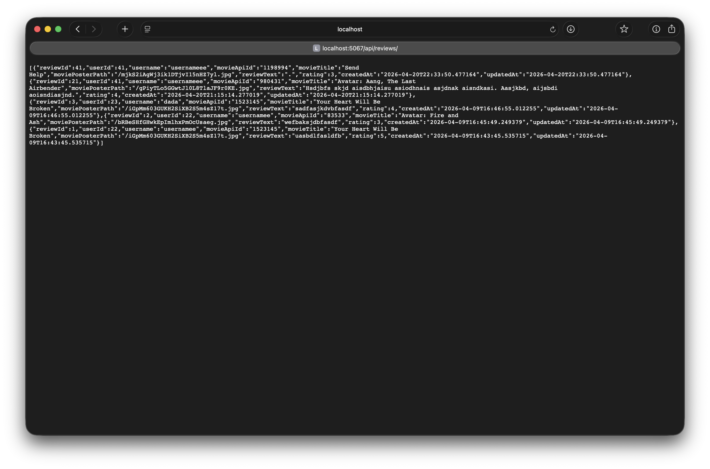

# SeeSharpReviews

SeeSharpReviews is a movie review web application built with ASP.NET Core MVC.
Users can search movies from TMDb, view details, create reviews, and manage their account with role-based access.

The solution is split into two apps: the main **MVC application** and a small **Reviews Web API microservice** that serves review data over HTTP.

## Project Overview

- **Course:** CPAN 369 (Web Programming)
- **Architecture:** ASP.NET Core MVC + dedicated ASP.NET Core Web API microservice
- **Authentication:** Cookie authentication (custom Account flow, no ASP.NET Identity)
- **External API:** TMDb (The Movie Database)
- **Database:** Oracle (EF Core provider)

## Tech Stack

- C# / .NET 9
- ASP.NET Core MVC (Razor Views) — main app
- ASP.NET Core Web API — Reviews microservice
- Entity Framework Core
- Oracle.EntityFrameworkCore
- BCrypt.Net-Next
- Bootstrap 5

## Current Features

- User registration and login
- Role-based authorization (`Admin`, `User`)
- Profile page with user reviews (reviews are fetched from the Reviews microservice)
- Account deletion flow
- Admin dashboard for user management
- Movie search and filtering (title, genre, year)
- Movie details from TMDb API
- Review create / edit / delete flows
- Themed UI with responsive navigation and footer

## Roles

- **Guest**
  - View Home, Movies, and movie details
  - Cannot create/edit/delete reviews
- **User**
  - All Guest permissions
  - Can create, edit, and delete own reviews
- **Admin**
  - All User permissions
  - Access to admin dashboard and user-management operations

## Microservice: `SeeSharpReviews.Api`

A separate ASP.NET Core Web API project that serves review data over HTTP. The MVC app's **Profile page** consumes this service (via a typed `HttpClient`) instead of loading reviews from the database directly.

### Endpoints

| Method | Route | Description |
|---|---|---|
| `GET` | `/api/reviews` | All reviews (newest first) |
| `GET` | `/api/reviews?take=N` | Latest `N` reviews |
| `GET` | `/api/reviews/{id}` | A single review by id |
| `GET` | `/api/reviews/user/{userId}` | All reviews by a specific user (used by the Profile page) |

### Design

- Reuses the MVC project's `AppDbContext` via a `<ProjectReference>` — no duplicated schema.
- Returns a flat `ReviewDto` (flattens `User.Username`) to avoid EF navigation serialization loops.
- MVC's `ReviewsApiClient` wraps calls in try/catch so a downed microservice never crashes the Profile page.

## Project Structure

```text
SeeSharpReviews/
  SeeSharpReviews/              # Main MVC application
    Controllers/
    Models/
    Views/
    Data/
    Services/
    Migrations/
    wwwroot/
  SeeSharpReviews.Api/          # Reviews microservice (Web API)
    Controllers/
    Models/
    Program.cs
  docs/
    screenshots/
```

## Setup Instructions

### 1) Clone and enter the project

```bash
git clone https://github.com/JoshuaSubray/SeeSharpReviews.git
cd SeeSharpReviews
```

### 2) Restore packages for both projects

```bash
dotnet restore SeeSharpReviews/SeeSharpReviews.csproj
dotnet restore SeeSharpReviews.Api/SeeSharpReviews.Api.csproj
```

### 3) Configure local settings

You need a dev config for **both** projects. Both files are gitignored.

#### `SeeSharpReviews/SeeSharpReviews/appsettings.Development.json`

```json
{
  "ConnectionStrings": {
    "DefaultConnection": "YOUR_ORACLE_CONNECTION_STRING"
  },
  "TMDb": {
    "ApiKey": "YOUR_TMDB_API_KEY",
    "BaseUrl": "https://api.themoviedb.org/3/"
  },
  "ReviewsApi": {
    "BaseUrl": "http://localhost:5067/"
  }
}
```

#### `SeeSharpReviews.Api/appsettings.Development.json`

```json
{
  "ConnectionStrings": {
    "DefaultConnection": "YOUR_ORACLE_CONNECTION_STRING"
  }
}
```

> The API's `BaseUrl` in the MVC config must match the port the API actually listens on. Check the terminal output when the API starts (`Now listening on: http://localhost:PORT`) and update if needed.

### 4) Apply database migrations

From the MVC project folder:

```bash
cd SeeSharpReviews
dotnet ef database update
```

### 5) Run both apps (two terminals)

**Terminal 1 — start the microservice:**

```bash
dotnet run --project SeeSharpReviews.Api
```

**Terminal 2 — start the MVC app:**

```bash
dotnet run --project SeeSharpReviews/SeeSharpReviews.csproj
```

The Profile page (`/Account/Profile`) loads review data from the running microservice. If the microservice is stopped, the rest of the MVC app still works — the Profile page's review list will simply be empty (graceful fallback).

## Default Routes

### MVC app

- `/` → Home page
- `/Movie` → Movie search and filters
- `/Account/Register` → Register
- `/Account/Login` → Login
- `/Account/Profile` → Profile (reviews fetched from the microservice)
- `/Admin/Dashboard` → Admin-only dashboard

### Microservice

- `/api/reviews`
- `/api/reviews?take=N`
- `/api/reviews/{id}`
- `/api/reviews/user/{userId}`

## Deployment

> **Note:** Online deployment is not available.
>
> The project uses an **Oracle database hosted locally inside a virtual machine**,
> which is not reachable from public hosting platforms (Azure, Render, Railway, etc.).
> Because of this, both apps are intended to be **run and demoed locally**
> using the setup steps above.

## Screenshots

### Home Page


### Register


### Login


### Profile


### Movie Search


### Movie Details


### Create Review


### Edit Review


### Delete Review


### Admin Dashboard


### Microservice JSON Response


