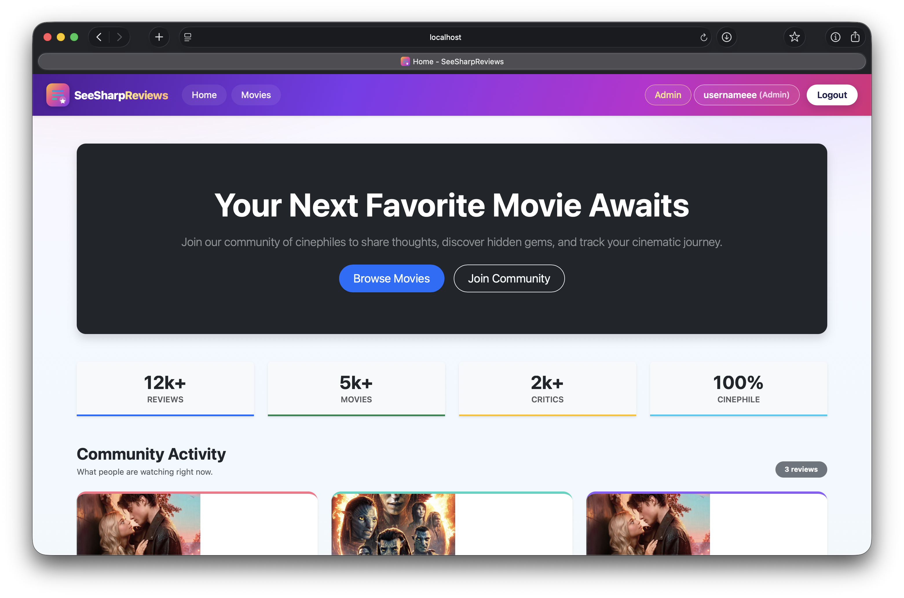
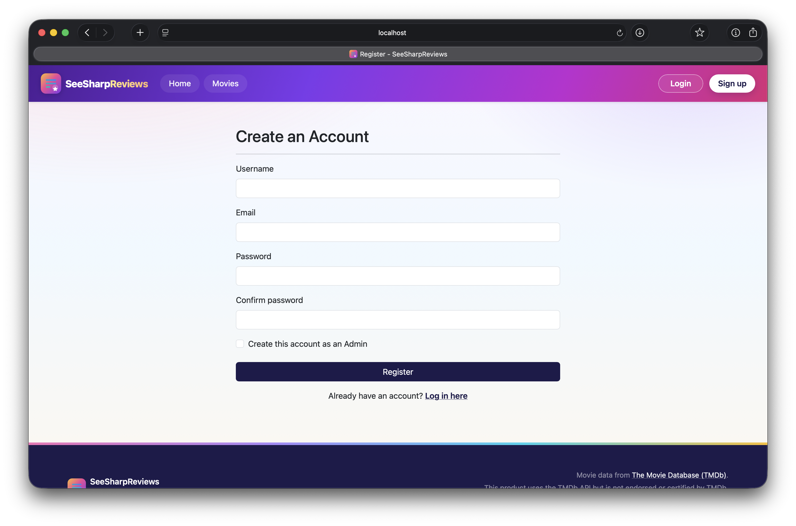
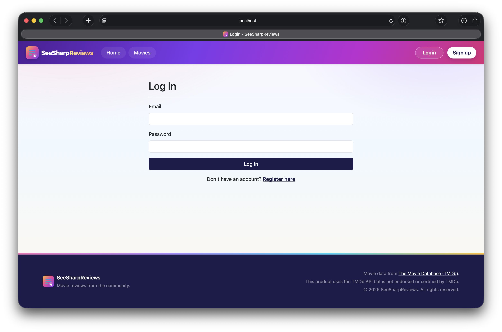
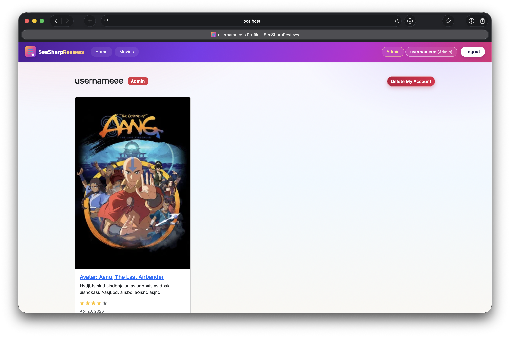
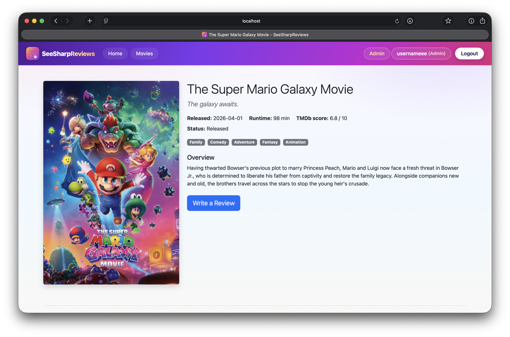
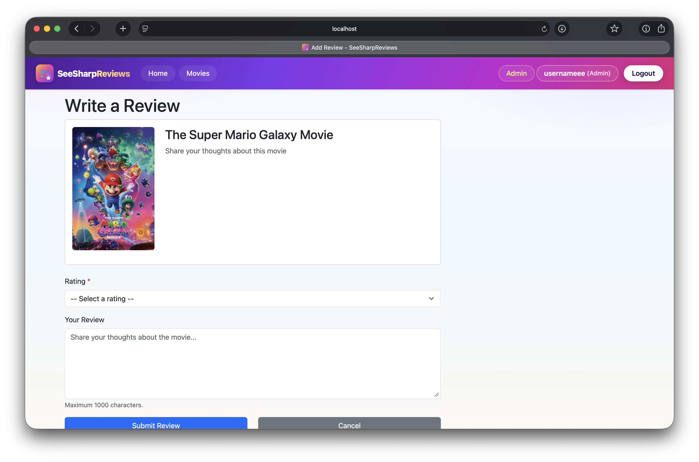
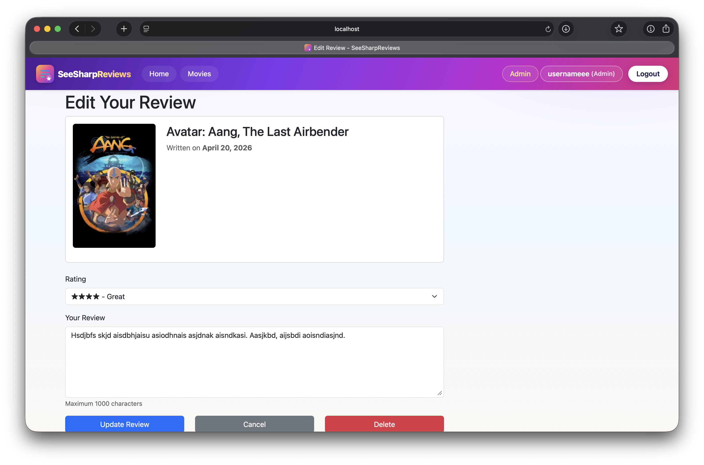
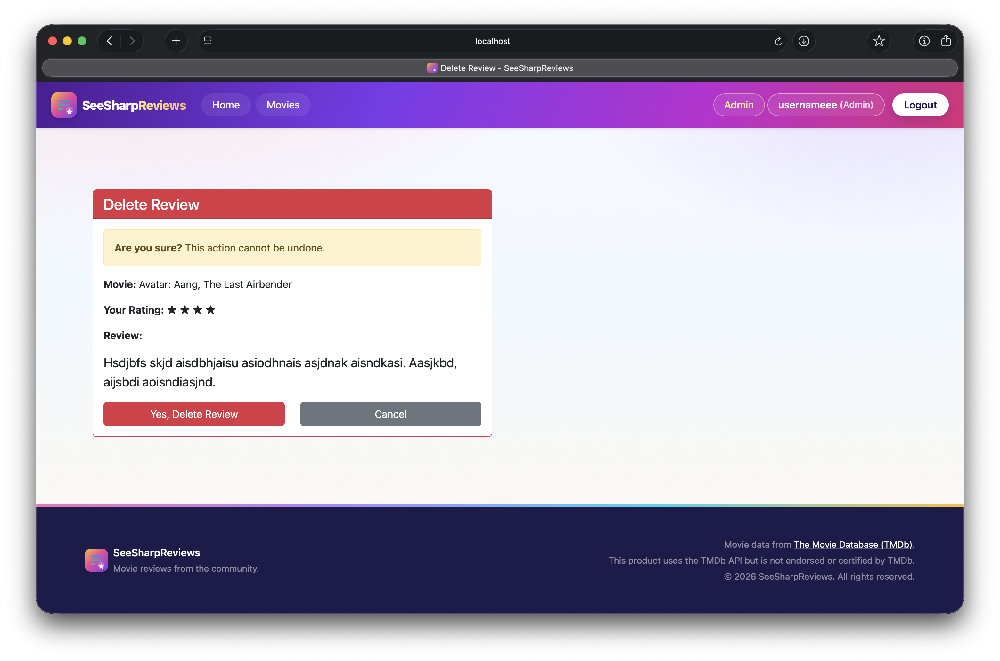
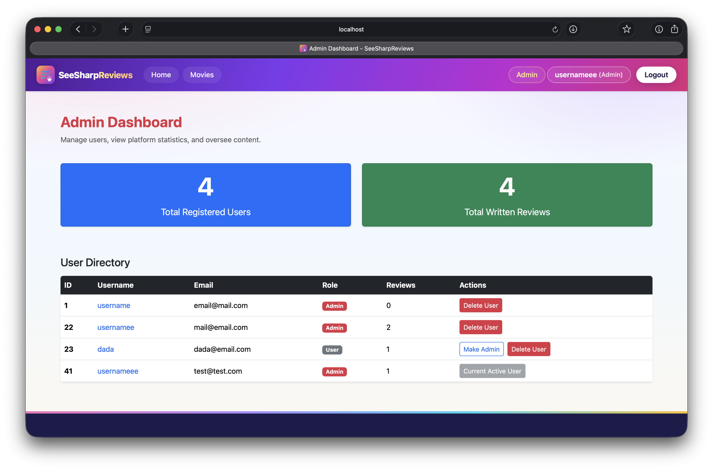

# SeeSharpReviews

SeeSharpReviews is a movie review web application built with ASP.NET Core MVC.  
Users can search movies from TMDb, view details, create reviews, and manage their account with role-based access.

## Project Overview

- **Course:** CPAN 369 (Web Programming)
- **Architecture:** ASP.NET Core MVC + Entity Framework Core
- **Authentication:** Cookie authentication (custom Account flow, no ASP.NET Identity)
- **External API:** TMDb (The Movie Database)
- **Database:** Oracle (EF Core provider)

## Tech Stack

- C# / .NET 9
- ASP.NET Core MVC (Razor Views)
- Entity Framework Core
- Oracle.EntityFrameworkCore
- BCrypt.Net-Next
- Bootstrap 5

## Current Features

- User registration and login
- Role-based authorization (`Admin`, `User`)
- Profile page with user reviews
- Account deletion flow
- Admin dashboard for user management
- Movie search and filtering (title, genre, year)
- Movie details from TMDb API
- Review create / edit / delete flows
- Themed UI with responsive navigation and footer

## Roles

- **Guest**
  - View Home, Movies, and movie details
  - Cannot create/edit/delete reviews
- **User**
  - All Guest permissions
  - Can create, edit, and delete own reviews
- **Admin**
  - All User permissions
  - Access to admin dashboard and user-management operations

## Project Structure

```text
SeeSharpReviews/
  SeeSharpReviews/              # Main MVC application
    Controllers/
    Models/
    Views/
    Data/
    Services/
    wwwroot/
```

## Setup Instructions

### 1) Clone and enter project

```bash
git clone https://github.com/JoshuaSubray/SeeSharpReviews.git
cd SeeSharpReviews/SeeSharpReviews
```

### 2) Restore packages

```bash
dotnet restore
```

### 3) Configure local settings

Create/update `appsettings.Development.json` with:

- `ConnectionStrings:DefaultConnection`
- `TMDb:ApiKey`
- `TMDb:BaseUrl` (usually `https://api.themoviedb.org/3/`)

Example:

```json
{
  "ConnectionStrings": {
    "DefaultConnection": "YOUR_ORACLE_CONNECTION_STRING"
  },
  "TMDb": {
    "ApiKey": "YOUR_TMDB_API_KEY",
    "BaseUrl": "https://api.themoviedb.org/3/"
  }
}
```

### 4) Apply database migrations

```bash
dotnet ef migrations add InitialCreate
dotnet ef database update
```

### 5) Run the app

```bash
dotnet watch run
```

## Default Routes

- `/` -> Home page
- `/Movie` -> Movie search and filters
- `/Account/Register` -> Register
- `/Account/Login` -> Login
- `/Account/Profile` -> Profile
- `/Admin/Dashboard` -> Admin-only dashboard

## Screenshots

### Home Page



### Register



### Login



### Profile



### Movie Search


### Movie Details



### Create Review



### Edit Review



### Delete Review



### Admin Dashboard


